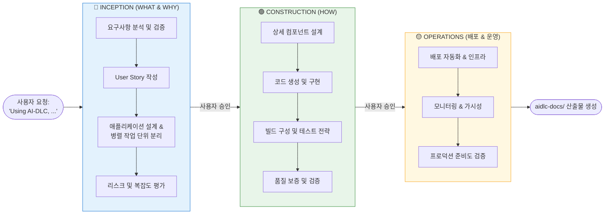
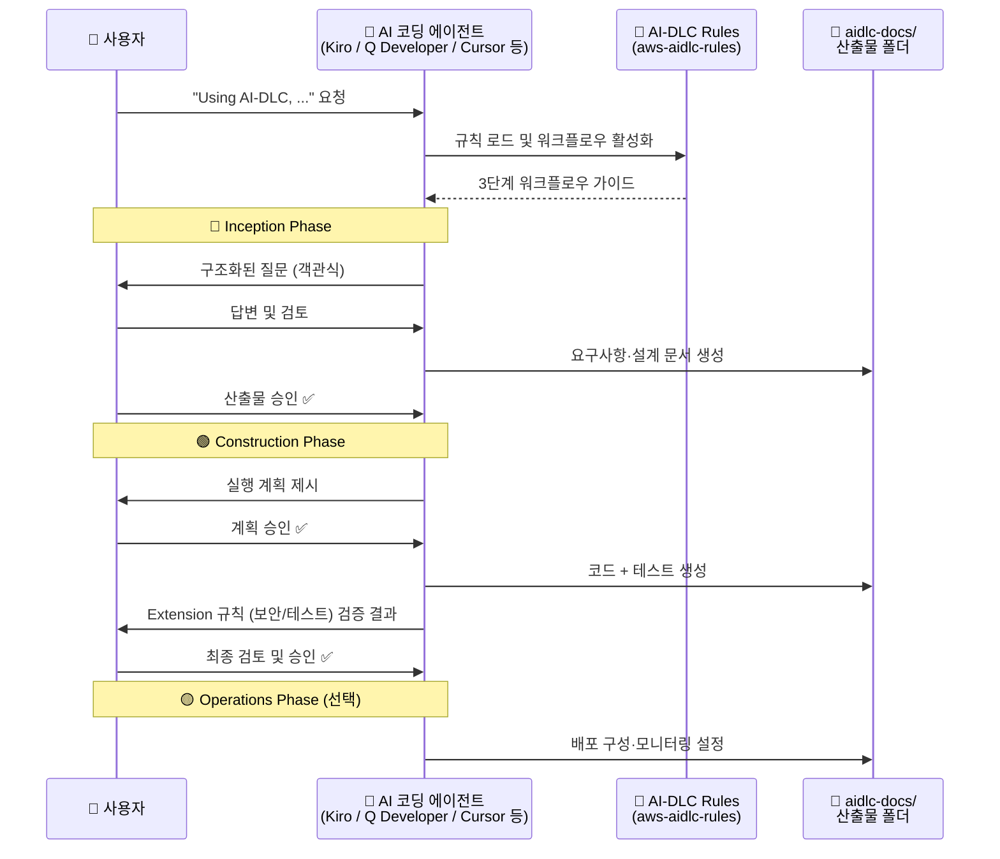
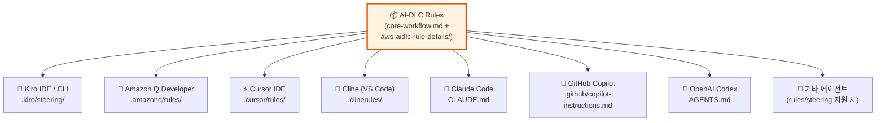

# AI-DLC (AI-Driven Development Life Cycle) 소개

> AWS가 오픈소스로 공개한, AI 기반 소프트웨어 개발 생애주기 워크플로우
> GitHub: https://github.com/awslabs/aidlc-workflows

---

## 1. AI-DLC란 무엇인가요?

**AI-DLC(AI-Driven Development Life Cycle)** 는 AWS Labs에서 오픈소스로 공개한 **AI 코딩 에이전트용 적응형(Adaptive) 개발 워크플로우 방법론**입니다.

단순한 도구(tool)가 아닌 **방법론(methodology)** 으로, 다음과 같은 특징을 가집니다.

- 사용자의 요청과 프로젝트 복잡도에 맞게 **필요한 단계만 선택적으로 실행**
- 요구사항부터 설계, 구현, 품질 검증까지 **구조화된 3단계 워크플로우**로 안내
- **사람(Human-in-the-loop)** 이 각 단계의 산출물을 검토·승인하며 AI와 협업
- Kiro, Amazon Q Developer, Cursor, Cline, Claude Code, GitHub Copilot, OpenAI Codex 등 **주요 AI 코딩 에이전트와 호환**

한 문장으로 요약하면,
👉 **"AI 코딩 어시스턴트에게 체계적인 소프트웨어 개발 프로세스를 따르게 만드는 규칙 세트(Steering Rules)"** 입니다.

---

## 2. 왜 AI-DLC가 필요한가요?

AI 코딩 어시스턴트를 사용할 때 고객들이 자주 겪는 문제는 다음과 같습니다.

| 기존 AI 코딩의 문제점 | AI-DLC의 해결 방식 |
|---|---|
| 요구사항 정의 없이 바로 코드 생성 → 재작업 발생 | Inception 단계에서 요구사항/설계를 먼저 정리 |
| 프로젝트마다 프롬프트 품질이 달라 결과 편차 큼 | 표준화된 규칙으로 **재현 가능한(reproducible)** 결과 |
| 복잡도에 관계없이 동일한 방식으로 작업 | **적응형(Adaptive)** 으로 필요한 단계만 수행 |
| 보안/컴플라이언스 규칙 누락 | Extension으로 보안·테스트·조직 규칙을 **차단(blocking) 조건**으로 강제 |
| AI가 마음대로 의사결정 | 단계별 **사용자 승인** 필수 |

---

## 3. 3단계 적응형 워크플로우

AI-DLC는 프로젝트 복잡도에 맞춰 유연하게 작동하는 3단계 워크플로우로 구성됩니다.



### 🔵 Inception Phase — 무엇(WHAT)을, 왜(WHY) 만드는가

- 요구사항 분석 및 검증
- User Story 작성 (필요 시)
- 애플리케이션 설계 및 병렬 개발 가능한 단위로 분리
- 리스크·복잡도 평가

### 🟢 Construction Phase — 어떻게(HOW) 만드는가

- 상세 컴포넌트 설계
- 코드 생성 및 구현
- 빌드 구성 및 테스트 전략 수립
- 품질 보증 및 검증

### 🟡 Operations Phase — 배포와 운영 (향후 확장)

- 배포 자동화 및 인프라 구성
- 모니터링 및 관측성 설정
- 프로덕션 준비도 검증

---

## 4. 핵심 기능(Key Features)

| 기능 | 설명 |
|---|---|
| **Adaptive Intelligence** | 요청에 가치가 있는 단계만 선별 실행 |
| **Context-Aware** | 기존 코드베이스와 복잡도를 분석 |
| **Risk-Based** | 복잡한 변경은 포괄적 처리, 단순한 변경은 간결하게 |
| **Question-Driven** | 채팅이 아닌 파일 형태의 구조화된 객관식 질문 |
| **Always in Control** | 사용자가 실행 계획과 단계별 산출물을 검토·승인 |
| **Extensible** | 보안·컴플라이언스·조직별 규칙을 Extension으로 추가 가능 |

---

## 5. AI-DLC의 작동 방식



---

## 6. Extension 시스템 — 조직 맞춤형 규칙

AI-DLC는 **핵심 워크플로우(core) 위에 조직/프로젝트 고유 규칙을 얹을 수 있는 Extension 구조**를 제공합니다.

### 기본 제공 Extensions

- **Security Baseline** — 보안 기본 규칙 (참고용, 조직별 커스터마이징 권장)
- **Property-Based Testing** — 속성 기반 테스트 규칙

### Extension 동작 방식

1. 워크플로우 시작 시 `extensions/` 폴더를 스캔하여 `*.opt-in.md` 파일 확인
2. Requirements Analysis 단계에서 **사용자에게 opt-in 여부 질문**
3. Opt-in 시 해당 규칙이 **차단(blocking) 조건**으로 활성화
4. 각 단계에서 규칙 위반 시 진행 불가 → 위반 해결 후 진행

### 고객사 자체 Extension 추가 예시

```text
aws-aidlc-rule-details/
└── extensions/
    ├── security/
    │   └── baseline/       # 기본 제공
    ├── testing/
    │   └── property-based/ # 기본 제공
    └── compliance/         # 🆕 고객사 추가
        └── k-isms/
            ├── k-isms.md         # K-ISMS 컴플라이언스 규칙
            └── k-isms.opt-in.md  # Opt-in 프롬프트
```

---

## 7. 지원 플랫폼 — 벤더 중립(Agnostic)

AI-DLC의 핵심 원칙 중 하나는 **Agnostic(벤더 중립)** 입니다. 주요 AI 코딩 에이전트를 모두 지원합니다.



---

## 8. AI-DLC의 핵심 원칙(Tenets)

| 원칙 | 의미 |
|---|---|
| **No duplication** | 진실의 원천(Single Source of Truth)은 한 곳에만 존재 |
| **Methodology first** | 도구가 아닌 방법론이 우선. 설치 없이 시작 가능 |
| **Reproducible** | 다른 모델에서도 유사한 결과가 나오도록 명확한 가이드 제공 |
| **Agnostic** | 특정 IDE·에이전트·모델에 종속되지 않음 |
| **Human in the loop** | 중요한 결정은 반드시 사용자 확인 필요 |

---

## 9. 고객에게 주는 가치

### 🎯 개발 생산성 향상
- 요구사항 → 설계 → 구현 → 검증이 **하나의 연속된 파이프라인**으로 연결
- 병렬 작업 단위 자동 분리로 멀티 에이전트 개발 가능

### 🛡️ 품질 및 거버넌스 강화
- Extension을 통한 **보안·컴플라이언스 규칙 강제**
- 단계별 사용자 승인으로 **AI의 폭주(hallucination) 방지**

### 💰 AI 활용 ROI 극대화
- 이미 도입한 Kiro, Amazon Q, Cursor 등 **기존 AI 도구에 바로 적용**
- 별도 라이선스·설치 없이 **규칙 파일 복사만으로 시작**

### 🔄 표준화된 개발 경험
- 팀·프로젝트 간 편차 감소 → **예측 가능한 산출물**
- 모든 결과물이 `aidlc-docs/` 폴더에 체계적으로 축적 → **자산화**

---

## 10. 도입 방법 (Quick Start)

### 1️⃣ 다운로드
GitHub Releases에서 최신 `ai-dlc-rules-v<버전>.zip` 다운로드
👉 https://github.com/awslabs/aidlc-workflows/releases/latest

### 2️⃣ 에이전트에 맞게 설치
예시 (Kiro의 경우):
```bash
mkdir -p .kiro/steering
cp -R ~/Downloads/aidlc-rules/aws-aidlc-rules .kiro/steering/
cp -R ~/Downloads/aidlc-rules/aws-aidlc-rule-details .kiro/
```

### 3️⃣ 사용
AI 채팅에 **"Using AI-DLC, ..."** 로 시작하는 요청을 입력하면 워크플로우가 자동으로 활성화됩니다.

> 💡 **실험적 기능**: AI 에이전트가 직접 다운로드·설치까지 자동화하는 "AI-Assisted Setup" 프롬프트도 제공됩니다.

---

## 11. 더 알아보기

| 리소스 | 링크 |
|---|---|
| GitHub 저장소 | https://github.com/awslabs/aidlc-workflows |
| Method Definition Paper | https://prod.d13rzhkk8cj2z0.amplifyapp.com/ |
| AI-DLC 방법론 블로그 | https://aws.amazon.com/blogs/devops/ai-driven-development-life-cycle/ |
| 오픈소스 런칭 블로그 | https://aws.amazon.com/blogs/devops/open-sourcing-adaptive-workflows-for-ai-driven-development-life-cycle-ai-dlc/ |
| Amazon Q Developer 활용 예시 | https://aws.amazon.com/blogs/devops/building-with-ai-dlc-using-amazon-q-developer/ |
| 라이선스 | MIT-0 (상업적 사용 가능) |

---

## 12. 요약

> **AI-DLC는 "AI 코딩 에이전트를 위한 소프트웨어 개발 표준 프로세스"입니다.**
>
> - 🧭 **3단계 워크플로우**(Inception → Construction → Operations)로 AI의 결과물을 체계화
> - 🎛️ **적응형** 실행으로 단순한 작업은 빠르게, 복잡한 작업은 꼼꼼하게
> - 🧑‍💻 **Human-in-the-loop** 으로 통제권은 항상 사용자에게
> - 🔌 **Agnostic** 설계로 Kiro, Amazon Q, Cursor 등 주요 도구에 즉시 적용 가능
> - 🛡️ **Extension** 으로 조직 고유의 보안·컴플라이언스 규칙 확장 가능

AWS의 **Responsible AI 원칙**을 따르며, **MIT-0 라이선스**로 누구나 자유롭게 사용·수정·배포할 수 있습니다.
